<div align="center">

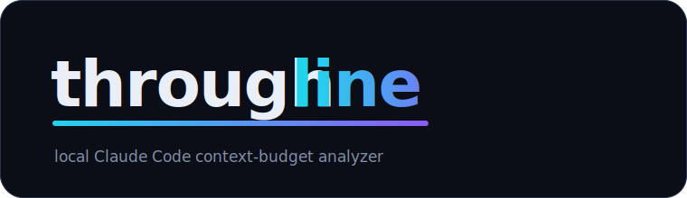

**Where your Claude Code context budget actually goes — and which tools are worth their cost.**

`100% local` · `no network` · `no telemetry` · `Python stdlib only`

**▶ [Live demo dashboard](https://akharytonchyk.github.io/throughline/)** — interactive, synthetic data

</div>

---

Throughline is a local, single-user tool that shows where your **Claude Code context budget**
goes — which tools and data earn their context cost — and finds recurring tool-call chains
worth collapsing into a single intent-based MCP tool.

**100% local. No network, no telemetry, no cloud, no accounts.** It reads Claude Code session
transcripts read-only; all output stays under `~/.throughline/`. Python standard library only —
zero third-party dependencies. See [`.specify/memory/constitution.md`](.specify/memory/constitution.md).

> Screenshots below are from a **synthetic demo dataset** (fake `orbit/*` repos and `jira`/`browser`
> MCP servers). Your real data never leaves your machine.

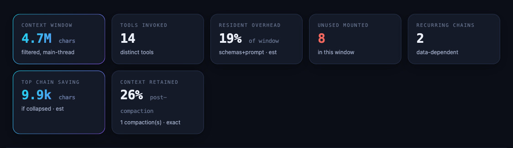

## Install

Requires Python 3.11+. No dependencies to install.

```bash
pip install -e .          # or just run with: PYTHONPATH=src python3 -m throughline ...
```

## Two commands

```bash
throughline collect        # copy your Claude Code sessions (read-only) into ~/.throughline
throughline report --open  # build a single self-contained dashboard.html and open it
```

The dashboard answers three questions:

1. **Where does my context go** — a breakdown of the whole main-thread context window by
   source: each built-in tool, MCP tools by server/tool, per-tool resident (schema) cost,
   non-tool content, and an explicit unattributed bucket. Mounted-but-never-called tools
   show up with 0 calls — your unmount candidates.
2. **Tool heatmap** — every tool you invoked, by call frequency × volume returned.
3. **Sequential patterns** — recurring, data-dependent tool chains (with fan-out), ranked
   by the context a single intent-based tool would save, each with a proposed tool.

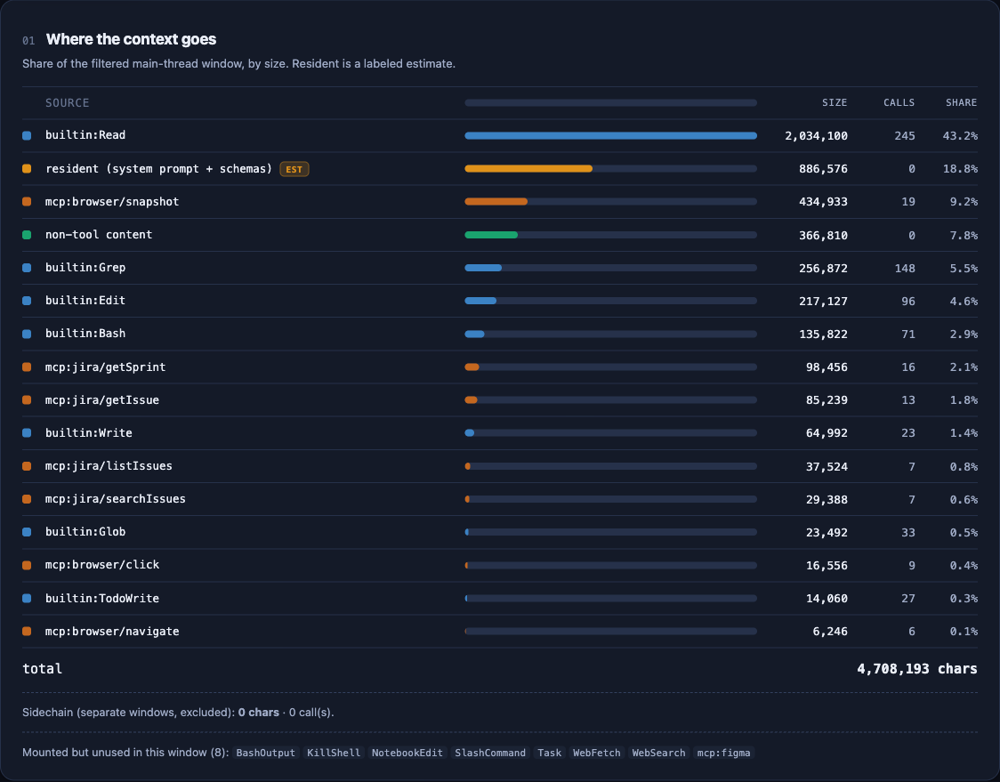

*Every source ranked by share of the window. `resident` (system prompt + tool schemas) is a
labeled estimate; mounted-but-unused tools are listed underneath as unmount candidates.*

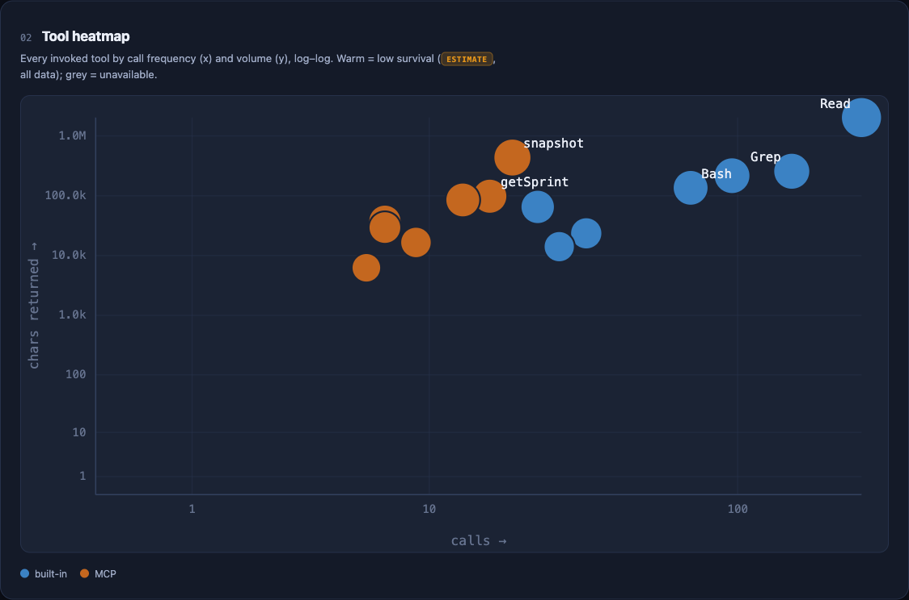

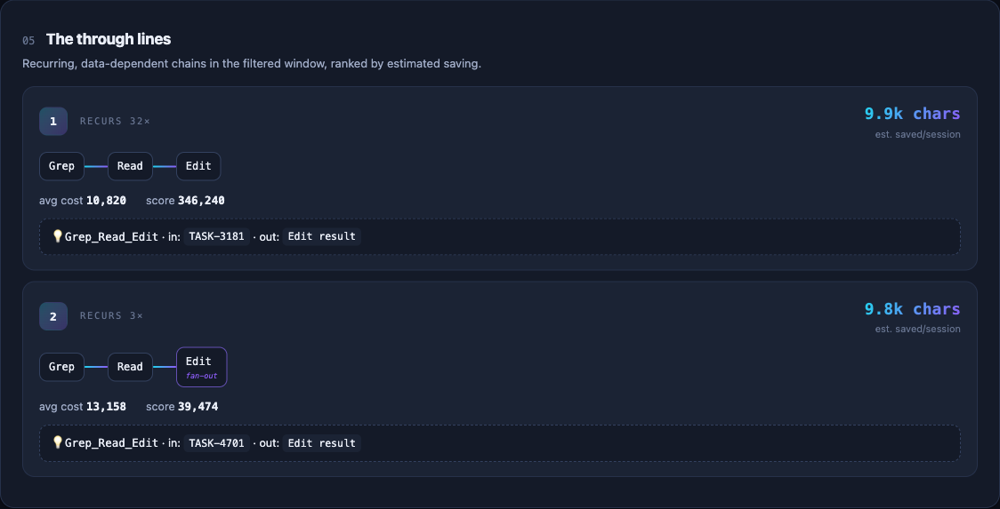

*The chain miner links calls by data dependency (an output reappearing in the next call's
input), then proposes a single intent-based tool to collapse the round-trips.*

### Cost over time & filters (experiment tracker)

The dashboard also lets you **measure your own optimizations** over time — everything below
updates **instantly, client-side**, when you change the filter bar (no re-run):

- **Cost over time** — pick a tool and see its **average size per call** over time. Started
  passing `offset`/`limit` to `Read`? Watch its per-call line drop after that week (a raw
  total can hide it; the per-call average can't).
- **Filter by repo + time range** — narrow every view to one project and/or a date window,
  with a calendar picker and quick-range presets bounded to your data.
- **Cost by working mode** — context per call and per session, by `plan` / `auto` /
  `acceptEdits`, to see whether plan mode is cheaper.
- **Intervention markers** — annotate when you made a change; it shows as a line on the trends.

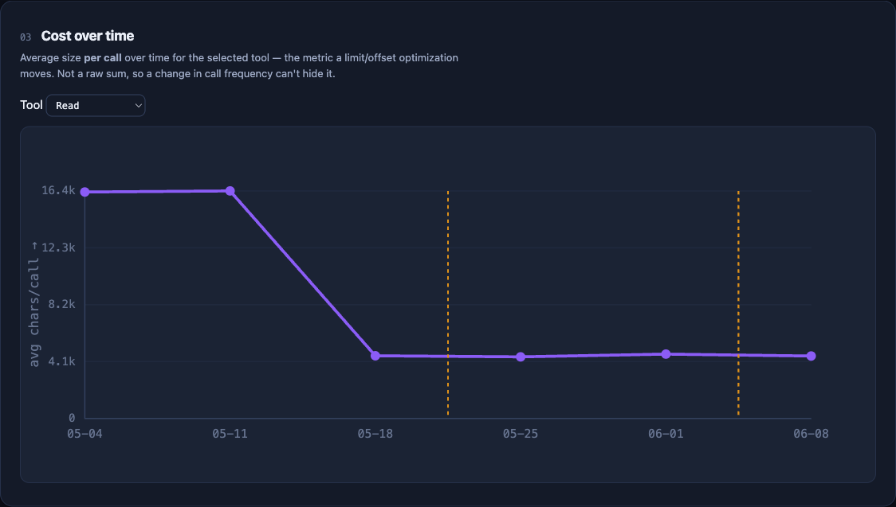

*Average size per call for the selected tool. Here `Read`'s per-call cost drops sharply right
after the "added Read offset/limit" marker — evidence the optimization actually landed.*

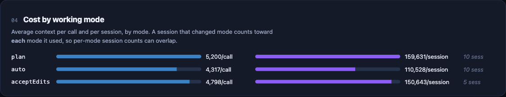

```bash
throughline note add --date 2026-07-03 --label "added Read offset/limit"
throughline note list
throughline report --project MyRepo --from 2026-07-01   # optional initial filter presets
```

Filtering is interactive in the browser over data embedded at generation time — the analysis
runs once, the page re-aggregates. Still one file, no network.

<details>
<summary><b>Full dashboard</b> — one scroll, all views</summary>

<br>

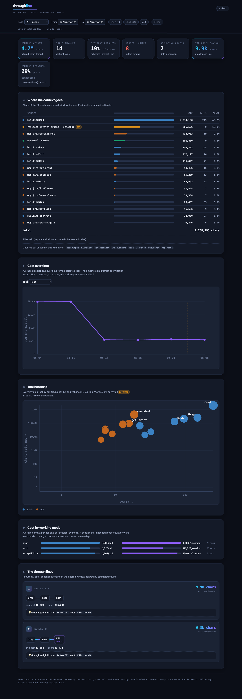

</details>

## Two lenses: Context window (chars) and Token usage (tokens)

The dashboard has a **lens switch** in the header. Everything above is the **Context window**
lens — *space*: what occupies the window, in **characters**, attributable **per tool**. The
second lens, **Token usage**, answers a different question — *flow*: what a session actually
**cost in tokens**, read **per assistant turn** straight from each turn's `usage`. The two are
**kept separate** (different units, different granularity) and never merged under the toggle.

Why it matters: a large resident/schema footprint is cheap in *space* (counted once) but
expensive in *flow* — it is re-sent as `cache_read` on **every turn**. On real data the window
is a few million chars while token flow is **~8.1B tokens, 96.5% of it `cache_read`** — the
context re-billed turn after turn. The occupancy lens structurally can't show that; this one does.

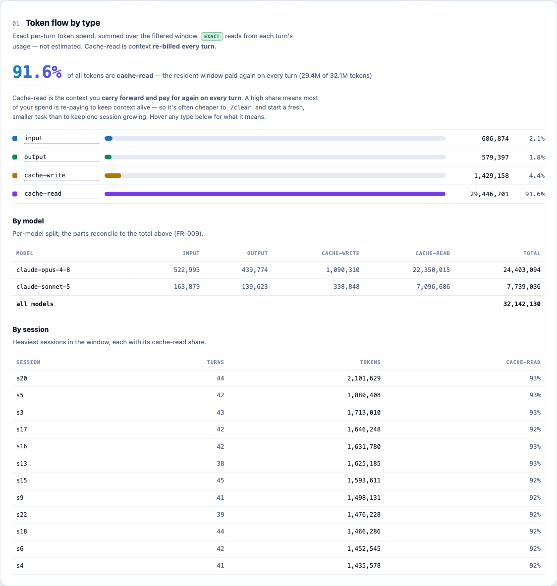

*Exact per-turn token spend by type, with the cache-read share called out and a per-model split
that reconciles to the total. Here 91.6% of all tokens are `cache_read` — context re-billed every turn.*

- **Token flow by type** — exact `input` / `output` / `cache-write` / `cache-read`, with the
  **cache-read share** called out, per session and overall, split **by model**. Counts are read
  verbatim from `usage`, so they are labeled **exact** (not estimated).
- **Re-billing growth** — a per-session cumulative curve; the filled band is `cache-read`, so you
  can *see* the resident context being re-paid every turn as a long session grows.

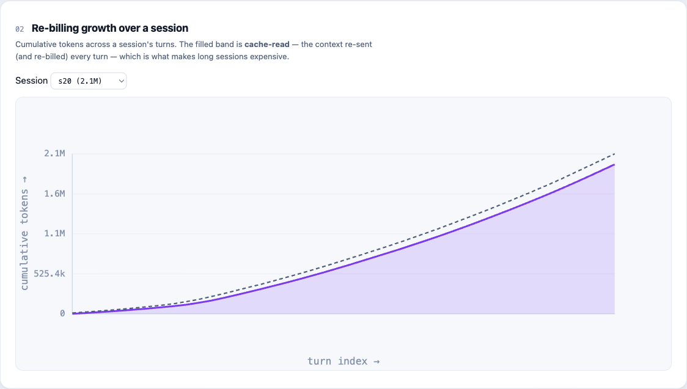

*Cumulative tokens across one session's turns — the filled band is `cache-read`, the context
re-sent (and re-billed) every turn, which is what makes long sessions expensive.*
- **Token spend over time** — a per-day/week token trend that honors the same repo/time filter and
  intervention markers, and **reads out the before/after change** in mean daily tokens at each marker.
- **Estimated cost** *(opt-in, empty by default)* — drop a per-model price list at
  `~/.throughline/prices.json` and a **labeled dollar estimate** appears (stating its price basis);
  with no price list, **no dollar figure appears anywhere**, and any model absent from the list is
  shown **unpriced**, never guessed.

Token counts come per **turn**, not per tool, so — unlike the chars breakdown — there is no exact
per-tool token figure, and the tool never presents one as if there were.

The token view is **self-explaining**: an always-visible caption states the cache-read lesson in
plain language, and each token type (and the cache-read share) carries a hover explanation
(dotted-underline = "hover me"). The headline insight is never hidden behind a tooltip.

### Biggest levers (burn-down)

The token lens opens with a **burn-down** panel: your biggest levers to cut daily context
burn, **ranked by projected tokens saved per day** (and, if you drop in a `prices.json`,
`$/day`). It unifies signals from the other views into one prioritized, actionable list —
mounted-but-unused tools, collapsible chains, and long re-billing sessions — so the answer to
*"where do I cut first?"* is a single sorted list, not three separate charts.

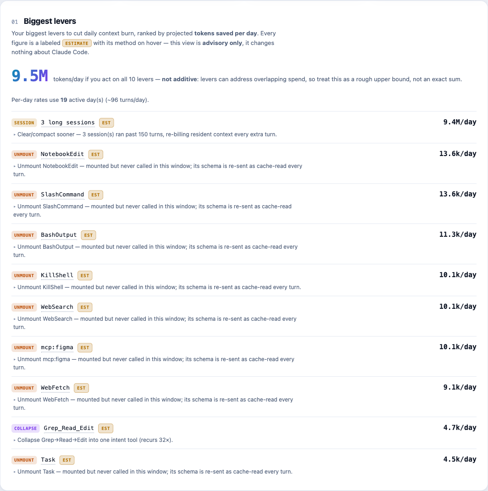

*Each lever names the change to make (unmount X · collapse Y→Z · clear/compact sooner), with a
labeled per-day saving. The headline aggregate is shown with an explicit **not-additive** caveat
(levers can overlap). It is **advisory only** — it never installs caps or changes Claude Code.*

Everything is a **labeled estimate** with its method on hover; the space signal (a tool's
resident schema) is bridged to the flow unit (tokens re-billed as `cache_read` every turn ×
turns/day) so a lever's saving maps to what actually drives the bill. With no `prices.json`, no
dollar figure appears — token savings still do.

## Estimates vs exact

Per-call and non-tool **sizes** are **exact** (characters/bytes); per-turn **token** counts are
**exact** too (read from `usage`). Four figures are **estimates**, always labeled with their
method: per-tool **resident** cost, the **survival** (essentialness) rate, projected **chain
savings**, and the opt-in **dollar cost** (your `prices.json` × recorded tokens).

## Optional: the essentialness signal (opt-in hooks)

The survival estimate needs pre-compaction detail that Claude Code discards during
compaction. To capture it, opt in to two passive logging hooks:

```bash
throughline hooks install    # consent-gated; backs up settings.json, merges (never overwrites)
throughline hooks status
throughline hooks uninstall  # removes only Throughline's entries
```

The hooks only log/copy — they never change how Claude Code behaves, and installation is
fully reversible.

## Configuration

```bash
throughline config                       # show effective config
throughline config --set size_unit=bytes
```

Config lives at `~/.throughline/config.json` (transcript dir, output path, size unit,
recurrence threshold, MCP config paths, opt-in state).

## Tests

```bash
PYTHONPATH=src python3 -m unittest discover -s tests   # 85 stdlib unittest (incl. token + resident-split goldens)
node --test tests/app_aggregate.test.mjs tests/token_flow.test.mjs tests/burndown.test.mjs   # 19 client-aggregation tests (dev-only)
```

## Scope

Claude Code only, single user, single machine, analyzing your own real sessions. Out of
scope: implementing the suggested tools, proxying MCP traffic, changing Claude Code
behavior beyond the opt-in logging, and anything multi-user/server/cloud.
